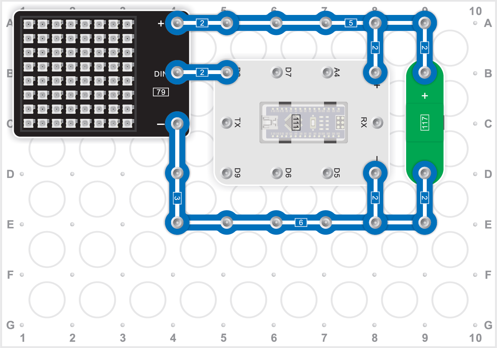
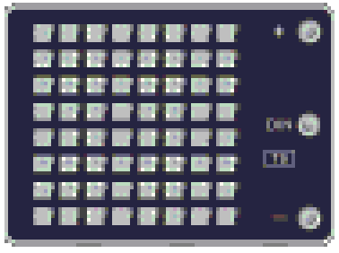
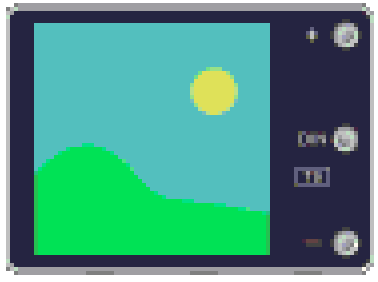

# GraphViz 2 GHPZ

idea: convert GraphViz to GraphZ format (so that it can be executed)

Note:

- with image (and a local URL, one can put an SVG image onto a node
- two subtasks: the graphical program and the circuit

## curcuit

source image

see `schaltkreis.dot`

## control flow (rechenablaufplan)

components

- start ("начало")

- components with one arrow in and one arrow out

	- LED-matritsa-risovanie.png

		

		parameter: 16x16, 12 farben

	- LED-matritsa-shablon.png

		

		 parameter: vorgegebene bilder

	- LED-matritsa-text.png

		

		parameter: farbe, sekunden, text

- taimer.png

	

	parameter: seconds

- tsikl.png 

	

	parameter: unknown, broken